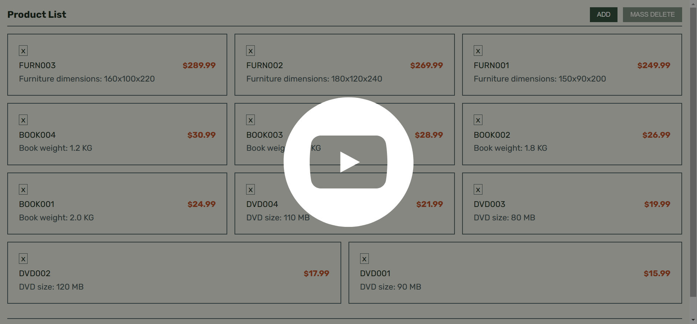

# Scandiweb Assignment

Welcome to my repository for Scandiweb Junior Developer test assignment. This web application is crafted using PHP, MySQL, Reactjs, React Query v4 (for efficient query caching), and SASS.

The application provides a user-friendly experience with two fundamental pages:

1. **Product List Page**: This page presents a list of products, and the ability to delete items seamlessly.

2. **Add Product Page**: Where users can effortlessly add new products to the system.

[Preview the app in 48 seconds!](https://youtu.be/2IST2s2vXg0)
[](https://youtu.be/2IST2s2vXg0)

<!-- **[Task Details](https://scandiweb.notion.site/Junior-Developer-Test-Task-1b2184e40dea47df840b7c0cc638e61e)** -->

## Table of Contents

- [Scandiweb Assignment](#scandiweb-assignment)
  - [Table of Contents](#table-of-contents)
  - [Prerequisites](#prerequisites)
  - [Getting Started](#getting-started)
  - [Project Structure](#project-structure)
  - [API Documentation](#api-documentation)

## Prerequisites

Before you begin, ensure you have the following software installed on your system to run the project successfully:

- [PHP](https://www.php.net/) (Hypertext Preprocessor)
- [MySQL](https://www.mysql.com/) (or any other compatible relational database)
- [Composer](https://getcomposer.org/) (Dependency Manager for PHP)
- [NPM](https://nodejs.org/en/download) (Node Package Manager needed for Reactjs)

## Getting Started

To get started, follow these steps:

1. **Clone the Repository:**

   ```bash
   git clone https://github.com/edriso/scandiweb-assignment.git
   ```

2. **Navigate to the Project Directory:**

   ```bash
   cd scandiweb-assignment
   ```

3. **Install Dependencies:**

   ```bash
   composer install
   cd client/
   npm install
   ```

4. **Configure Environment:**

   - Rename the `.env.example` file in the root directory to `.env` and update the necessary variables.

   ```bash
    mv .env.example .env
   ```

5. **Database Setup:**

   - Create a database with the same name specified in `.env` (default is `scandiweb_test_products`).
   - Run the SQL script found in `schema.sql` file in the root directory to create the required tables (`product_types`, `type_properties`, `products`) with appropriate schema and relations.

6. **Serve or Build the Frontend:**

   ```bash
   cd client/

   # For development:
   npm run dev

   # For production:
   npm run build
   ```

7. **Run the Start Script with No Timeout:**
   ```bash
   composer run-script start --timeout=0
   ```

## Project Structure

The project structure is designed to maintain clarity and organization. Here's a brief overview of the key directories:

- **client/**: This directory houses the ReactJS frontend, serving as the space where the user interface is developed and managed. All frontend-related assets and components are neatly organized within this section.

- **App/**: Houses the PHP backend code, containing the essential server-side logic that powers the application. It's further structured for improved organization:

  - **Core/**: This directory holds PHP core models and functions designed for broader usability across projects. It serves as a repository for reusable and foundational code.

  - **Http/**: Within this directory, you'll find controllers, validations, and models specific to this application, handling vital server-side logic.

  - **routes.php**: This file acts as the headquarters for API routes, defining paths along with their corresponding controllers and actions. It presents a clear map for handling incoming requests.

  - **helpers.php**: Dedicated to housing helper functions.

  - **config.php**: A file that returns the configuration settings.

- **public/**: Serves as the hosting location for index.php and the compiled front end, ensuring accessibility for users.

- **.env**: Reserved for environment variables.

- **schema.sql**: Represents the backbone of the database, defining its schema and structure.

## API Documentation

Explore the detailed API documentation using [Postman Documentation](https://documenter.getpostman.com/view/15155550/2s9Ykhg4M9).
